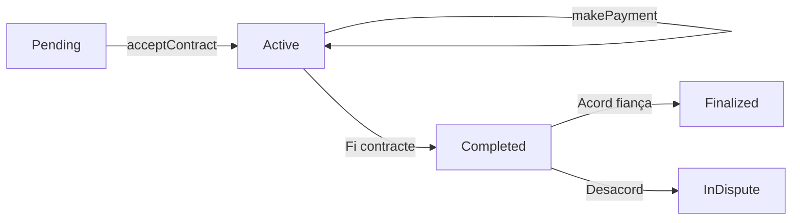

# Rental Contract - Smart Contract de Lloguer

Sistema descentralitzat de gestió de contractes de lloguer a la blockchain MultiversX, sense intermediaris.

[](https://devnet-explorer.multiversx.com/accounts/)
[](https://www.rust-lang.org/)
[](output/rental-contract.wasm)

## Descripció

Smart contract que permet crear, gestionar i finalitzar contractes de lloguer entre propietaris i llogaters, amb dipòsit de fiança, pagaments i retorn/retenció de la fiança al final del contracte.

### Flux principal:

- **Creació del contracte** per part del propietari
- **Acceptació i pagament de fiança** pel llogater
- **Pagaments mensuals** pel llogater
- **Sistema de decisió de fiança** al finalitzar. Si hi ha acord, es retorna la fiança al llogater o la reté el propietari.
- **Si no hi ha acord, el contracte queda en disputa** i serà resolt per un àrbitre (no forma part del contracte)

## Estats del contracte

### Definició

```rust
pub enum ContractStatus {
    Pending,      // Pendent d'acceptació pel llogater
    Active,       // Actiu amb pagaments en curs
    Completed,    // Tots els pagaments realitzats
    InDispute,    // Desacord sobre la fiança
    Finalized,    // Finalitzat amb fiança retornada
}
```

### Flux del Contracte



## Endpoints

### Transaccions

| Endpoint | Descripció | Caller |
|----------|------------|--------|
| `createRentalContract` | Crea un nou contracte de lloguer | Propietari |
| `acceptContract` | Accepta el contracte i paga la fiança | Llogater |
| `makePayment` | Realitza un pagament mensual | Llogater |
| `landlordDecision` | Decisió del propietari sobre la fiança | Propietari |
| `tenantDecision` | Decisió del llogater sobre la fiança | Llogater |

### Views (Només lectura)

| View | Descripció |
|------|------------|
| `getContractDetails` | Obté tots els detalls d'un contracte |
| `getContractsByLandlord` | Llista contractes d'un propietari |
| `getContractsByTenant` | Llista contractes d'un llogater |
| `getDepositDecisionDetails` | Obté l'estat de les decisions sobre la fiança |
| `getPaymentsStatus` | Obté l'estat dels pagaments |

## Validacions del Contracte

- Verificació que el contracte existeix abans de qualsevol operació
- Control d'estats: només es permeten operacions en estats vàlids
- Pagaments: verificació d'import exacte i que el contracte està actiu
- Decisions sobre fiança:
  - Només es poden prendre quan el contracte ha acabat **O** està en estat `Completed`
  - Això permet provar la funcionalitat sense esperar que acabi el temps del contracte
  - Cada part només pot decidir una vegada
  - Si hi ha acord, la fiança es retorna/reté automàticament
  - Si hi ha desacord, el contracte passa a estat `InDispute`

## Desenvolupament

### Prerequisits

- Rust 1.86.0 o superior
- MultiversX SDK (`mxpy`)
- `sc-meta` tool

### Entorn de Desenvolupament

Aquest projecte s'ha desenvolupat utilitzant:
- **IDE**: Visual Studio Code
- **Extensions**: GitHub Copilot
- **Dev Container**: MultiversX Smart Contracts
  - Ubuntu 22.04.5 LTS
  - Rust 1.86.0 preinstal·lat
  - MultiversX SDK (`mxpy`) i `sc-meta`
  - Node.js i npm per al frontend
  - Docker CLI per a gestió de contenidors

### Build

```bash
# Compilar el contracte
sc-meta all build

# Output: output/rental-contract.wasm
```

### Deploy

El contracte es desplega fent servir un wallet, per exemple "wallet-owner.pem".

```bash
# Desplegar a devnet
mxpy contract deploy \
  --bytecode=output/rental-contract.wasm \
  --pem=~/wallet-owner.pem \
  --gas-limit=60000000 \
  --proxy=https://devnet-api.multiversx.com \
  --chain=D \
  --send
```

### Upgrade

El contracte s'actualitza fent referència al hash del contracte previ.

```bash
# Actualitzar a devnet
mxpy contract upgrade <hash_contracte> \
  --bytecode=output/rental-contract.wasm \
  --pem=~/wallet-owner.pem \
  --gas-limit=60000000 \
  --proxy=https://devnet-api.multiversx.com \
  --chain=D \
  --send
```

## Documentació tècnica del contracte

- **[Documentació Rustdoc](rental-contract/docs/rental_contract/index.html)** - Documentació completa del codi font

## Clients Disponibles

### Client Web (dApp React)

- **Tecnologies**: React 18 + TypeScript + Vite + Tailwind CSS
- **SDK**: @multiversx/sdk-dapp 3.1.6, @multiversx/sdk-core 13.16.0
- **Característiques**:
  - Interfície web reactiva
  - Connexió amb DeFi Wallet, xPortal, Ledger
  - Dashboard amb totes les funcionalitats del contracte
  - Gestió visual de contractes com a propietari o llogater
  - Notificacions de transaccions en temps real
- **Instal·lació**:
  ```bash
  cd rental-dapp
  npm install
  npm run start:devnet
  ```

- **URL en local**: http://localhost:3000 (devnet)

### Client CLI (Shell Script)

- **Fitxer**: [rental-contract/client.sh](rental-contract/client.sh)
- **Ús**: Interfície de línia de comandos per interactuar amb el contracte
- **Execució**:

```bash
cd rental-contract
./client.sh
```

**Menú interactiu:**
1. Crear nou contracte (Propietari)
2. Acceptar contracte i pagar fiança (Llogater)
3. Fer pagament de lloguer
4. Decisió propietari (retornar fiança)
5. Decisió llogater (acceptar retorn fiança)
6. Consultar contracte
7. Consultar decisions sobre fiança
8. Consultar estat de pagaments
9. Llistar contractes per propietari
10. Llistar contractes per llogater

**Wallets requerits:**

El client assumeix que existeixen tres wallets en el directori home:
- `wallet-owner.pem` - Propietari del Smart Contract
- `wallet-landlord.pem` - Propietari de l'immoble
- `wallet-tenant.pem` - Llogater

En els endpoints de transacció, cal seleccionar amb quina wallet es vol operar. El client també permet especificar una ruta personalitzada.

**Configuració del contracte:**

client.sh ja incorpora un paràmetre `CONTRACT` per identificar el hash del contracte. Caldrà modificar-lo per indicar el contracte a utilitzar.

## Estructura del Projecte

```
rental-sc-project/
├── README.md                           # Documentació principal del projecte
├── .gitignore                          # Exclusions Git del projecte
│
├── rental-contract/                    # Smart Contract (Rust)
│   ├── src/
│   │   └── rental_contract.rs          # Codi principal del contracte
│   ├── tests/
│   │   ├── rental_contract_scenario_rs_test.rs
│   │   └── rental_contract_scenario_go_test.rs
│   ├── scenarios/
│   │   └── rental_contract.scen.json   # Escenaris de test
    ├── output/
    │   ├── rental-contract.wasm        # Contracte compilat
    │   ├── rental-contract.abi.json    # ABI del contracte
    │   └── rental-contract.mxsc.json   # Metadata del contracte
│   ├── docs/                           # Documentació Rustdoc generada
│   │   └── rental_contract/
│   │       ├── index.html              # Entrada de la documentació
│   │       ├── struct.RentalContractData.html
│   │       └── ...                     # Documentació completa
│   ├── meta/                           # Meta crate per builds
│   ├── wasm/                           # Wasm builder crate
│   ├── client.sh                       # Script CLI d'interacció
│   ├── Cargo.toml                      # Dependencies Rust
│   ├── multiversx.json                 # Configuració MultiversX
│   └── .gitignore                      # Exclusions (target/, *.pem, output/)
│
└── rental-dapp/                        # Frontend dApp (React + TypeScript)
    ├── public/                         # Assets estàtics
    │   ├── favicon.ico
    │   ├── manifest.json
    │   └── ...                         # Imatges i icones
    ├── src/
    │   ├── App.tsx                     # Component principal
    │   ├── index.tsx                   # Entry point
    │   ├── components/                 # Components React
    │   │   ├── CreateContractForm.tsx  # Formulari creació contracte
    │   │   ├── Layout/                 # Layout i navegació
    │   │   └── ...
    │   ├── pages/                      # Pàgines de l'aplicació
    │   │   ├── Dashboard/              # Dashboard principal
    │   │   ├── ContractDetails/        # Detall d'un contracte
    │   │   ├── Home/                   # Pàgina inicial
    │   │   └── ...
    │   ├── hooks/                      # Custom React hooks
    │   │   └── useRentalContract.ts    # Hook d'interacció amb el contracte
    │   ├── types/                      # Definicions TypeScript
    │   │   └── rentalContract.types.ts # Types del contracte
    │   ├── contracts/                  # ABI del contracte
    │   │   └── rental-contract.abi.json
    │   ├── config/                     # Configuració de xarxes
    │   │   └── config.devnet.ts
    │   ├── routes/                     # Definició de rutes
    │   ├── services/                   # Serveis API
    │   ├── helpers/                    # Funcions auxiliars
    │   ├── utils/                      # Utilitats
    │   ├── assets/                     # Recursos (imatges, fonts)
    │   └── styles/                     # Estils globals
    ├── scripts/                        # Scripts de build i deploy
    ├── wdio/                           # Tests E2E WebdriverIO
    ├── index.html                      # HTML principal
    ├── package.json                    # Dependencies Node (1510 packages)
    ├── package-lock.json
    ├── tsconfig.json                   # Configuració TypeScript
    ├── vite.config.ts                  # Configuració Vite
    ├── tailwind.config.js              # Configuració Tailwind CSS
    ├── postcss.config.js               # PostCSS config
    ├── jest.config.js                  # Jest tests config
    ├── .eslintrc                       # ESLint config
    ├── .prettierrc                     # Prettier config
    ├── .swcrc                          # SWC compiler config
    └── .gitignore                      # Exclusions (node_modules/, *.pem)
```

## Exemples d'ús amb mxpy (endpoints i views)

### Crear un contracte

```bash
# Com a propietari
mxpy contract call <CONTRACT> \
  --pem=landlord.pem \
  --function=createRentalContract \
  --arguments <tenant_address> <deposit_egld> <monthly_rent_egld> <duration_months> <contract_reference_hex> \
  --gas-limit=10000000 \
  --proxy=https://devnet-api.multiversx.com \
  --chain=D \
  --send
```

### Acceptar contracte

```bash
# Com a llogater (pagar fiança)
mxpy contract call <CONTRACT> \
  --pem=tenant.pem \
  --function=acceptContract \
  --arguments <contract_id> \
  --value=<deposit_amount> \
  --gas-limit=10000000 \
  --proxy=https://devnet-api.multiversx.com \
  --chain=D \
  --send
```

### Fer pagament de lloguer

```bash
# Com a llogater (pagament mensual)
mxpy contract call <CONTRACT> \
  --pem=tenant.pem \
  --function=makePayment \
  --arguments <contract_id> \
  --value=<monthly_rent_amount> \
  --gas-limit=10000000 \
  --proxy=https://devnet-api.multiversx.com \
  --chain=D \
  --send
```

### Decisió del propietari sobre la fiança

```bash
# Com a propietari (return_deposit: 1=Sí retornar, 0=No retornar)
mxpy contract call <CONTRACT> \
  --pem=landlord.pem \
  --function=landlordDecision \
  --arguments <contract_id> <return_deposit> \
  --gas-limit=10000000 \
  --proxy=https://devnet-api.multiversx.com \
  --chain=D \
  --send
```

### Decisió del llogater sobre la fiança

```bash
# Com a llogater (return_deposit: 1=Sí accepto retornar, 0=No)
mxpy contract call <CONTRACT> \
  --pem=tenant.pem \
  --function=tenantDecision \
  --arguments <contract_id> <return_deposit> \
  --gas-limit=10000000 \
  --proxy=https://devnet-api.multiversx.com \
  --chain=D \
  --send
```

### Consultar detalls d'un contracte

```bash
# Query (no gasta gas)
mxpy contract query <CONTRACT> \
  --function=getContractDetails \
  --arguments <contract_id> \
  --proxy=https://devnet-api.multiversx.com
```

### Llistar contractes per propietari

```bash
# Query: Obtenir tots els contractes d'un propietari
mxpy contract query <CONTRACT> \
  --function=getContractsByLandlord \
  --arguments <landlord_address> \
  --proxy=https://devnet-api.multiversx.com
```

### Llistar contractes per llogater

```bash
# Query: Obtenir tots els contractes d'un llogater
mxpy contract query <CONTRACT> \
  --function=getContractsByTenant \
  --arguments <tenant_address> \
  --proxy=https://devnet-api.multiversx.com
```

### Consultar decisions sobre la fiança

```bash
# Query: Veure l'estat de les decisions sobre la fiança
mxpy contract query <CONTRACT> \
  --function=getDepositDecisionDetails \
  --arguments <contract_id> \
  --proxy=https://devnet-api.multiversx.com
```

### Consultar estat dels pagaments

```bash
# Query: Veure pagaments realitzats i pendents
mxpy contract query <CONTRACT> \
  --function=getPaymentsStatus \
  --arguments <contract_id> \
  --proxy=https://devnet-api.multiversx.com
```

## Llicència

Aquest projecte està sota llicència MIT. Consulta el fitxer `LICENSE` per més detalls.

## Autor

- **Daniel Garcia** - Desenvolupament inicial
- Desenvolupat amb l'assistència de **GitHub Copilot** (Claude Sonnet 4.5)


## 🔗 Enllaços

### Recursos MultiversX
- [MultiversX Docs](https://docs.multiversx.com/)
- [Rust Smart Contracts Guide](https://docs.multiversx.com/developers/developer-reference/sc-api-functions/)
- [MultiversX Devnet Explorer](https://devnet-explorer.multiversx.com/)

---
